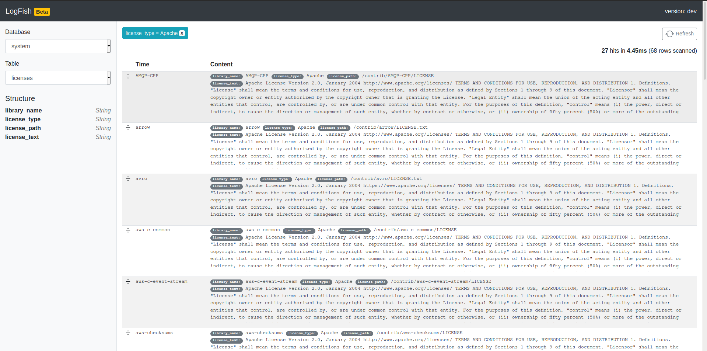

# LogFish

LogFish is a log explorer Web-based UI which is highly inspired by [Kibana](https://www.elastic.co/kibana) but use [ClickHouse](https://clickhouse.tech/) as a main
storage for logs. Even though LogFish is designed to provide better UX for logs investigation in mind, UI itself is pretty generic and can be used to explore and filter
content of any table in ClickHouse (however, some features like DateTime selection might not work since they require `timestamp` field to be presented in the table).

This project is WIP (early alpha status) and there could be significant changes between releases, therefore be careful when updating and make sure to check release notes.



## Features

- See databases and tables list
- Table structure overview
- Support for quick filters per field (column)
- DateTime range selection for tables with timestamp field

## Installation

* run in local

Update clickhouseHost in src/environments/environment.ts

```
npm install
npm run start
```

* run in docker
```
docker build -t image_name .
docker run -e CLICKHOUSE_URL='http://clickhouse_endpoint' -d -p 8000:8000 image_name
```

## Roadmap

- [ ] Support multiple filters for same column (String type mostly)
- [ ] Draw count histogram for tables with timestamp field
- [ ] Structure: select columns to change view of log table (single or multiple fields)
- [ ] Share links with pre-selected database/table/filters
- [ ] Choose ClickHouse instance dialog (username, password, host)
- [ ] Google-like search for all String columns
- [ ] Improve req/res management (cancellation and ordering)
- [ ] Helm chart for simple deployments
